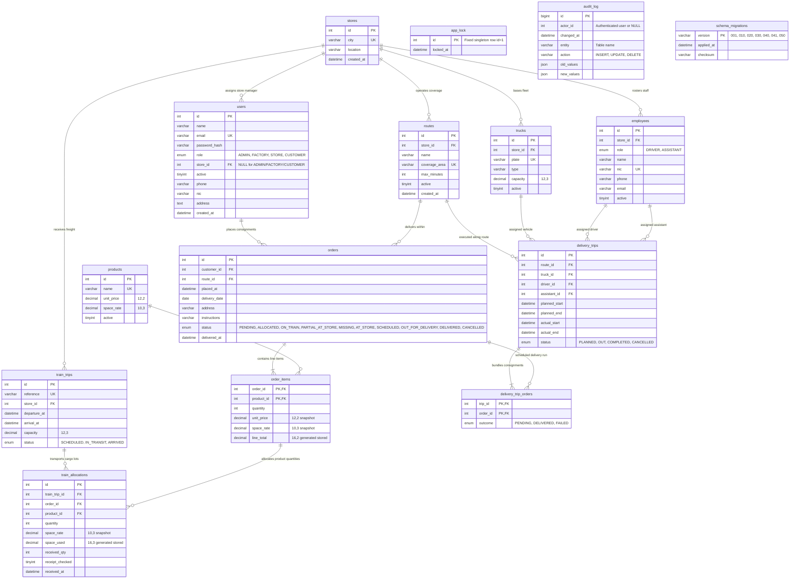

# KandyPack — Entity-Relationship Diagram & Schema Reference

> **Semester 3 Database Systems · Group 23**  
> **Database Engine:** MySQL 8.4 (InnoDB Storage Engine)  
> **Schema Name:** `kandypack`  
> **Character Set / Collation:** `utf8mb4` / `utf8mb4_0900_ai_ci`

---

## 1. Executive Architecture & Domain Model

KandyPack operates a **bi-modal rail-and-road distribution network** connecting a central manufacturing facility in Kandy with regional urban destination depots across Sri Lanka:

```
┌────────────────────────┐         ┌─────────────────────────┐         ┌────────────────────────┐
│  Kandy Central Factory │ ──────> │  Rail Freight Line-Haul │ ──────> │ Regional Stores/Depots │
│  (Catalog & Placement) │ (Train) │ (Capacity Bin-Packing)  │ (Store) │ (Cross-Dock Receipt)   │
└────────────────────────┘         └─────────────────────────┘         └────────────────────────┘
                                                                                    │
                                                                                    │ Road Fleet
                                                                                    ▼
                                                                       ┌────────────────────────┐
                                                                       │ Final-Mile Delivery    │
                                                                       │ (Trucks, Drivers, Crew)│
                                                                       └────────────────────────┘
```

1. **Customers & Orders:** Registered customers place advance consignment orders (minimum 7 days lead time) selecting a delivery coverage zone and multiple catalog products.
2. **Rail Intermodal Leg:** Orders are allocated to scheduled train freight trips using a greedy bin-packing algorithm with cursor loops (`sp_allocate_order`), splitting overflow across successive train departures.
3. **Regional Depot Receiving:** Trains depart Kandy and arrive at regional depot stores where store managers verify manifest lots and confirm received quantities (`sp_receive_allocation`).
4. **Road Final-Mile Leg:** Destination store managers bundle cross-docked orders at the depot, schedule local route delivery trips with dedicated trucks and compliant drivers/assistants (`sp_schedule_delivery`), dispatch the vehicle, and record return outcomes (`sp_return_delivery`).

---

## 2. Mermaid Entity-Relationship Diagram



---

## 3. Data Dictionary & Table Schemas

### 3.1 `stores` (Regional Depot Depots)
Primary organizational partition representing destination regional hubs across Sri Lanka (e.g., Colombo, Galle, Negombo, Jaffna, Matara, Kandy Central).
* `id` (`INT PRIMARY KEY AUTO_INCREMENT`): Unique depot identifier.
* `city` (`VARCHAR(80) NOT NULL UNIQUE`): Target destination municipality.
* `location` (`VARCHAR(255) NOT NULL`): Physical address/cross-dock logistics yard location.

### 3.2 `users` (System Principals & Credentials)
Role-based access control repository supporting `ADMIN`, `FACTORY`, `STORE` managers, and `CUSTOMER` accounts.
* `id` (`INT PRIMARY KEY AUTO_INCREMENT`): Unique user identifier.
* `email` (`VARCHAR(190) NOT NULL UNIQUE`): Authentication handle.
* `password_hash` (`VARCHAR(255) NOT NULL`): Secure bcrypt password hash.
* `role` (`ENUM('ADMIN','FACTORY','STORE','CUSTOMER') NOT NULL`): RBAC role token.
* `store_id` (`INT NULL, FK -> stores(id)`): Mandatory for `STORE` role; enforces physical store isolation.
* `active` (`BOOLEAN NOT NULL DEFAULT TRUE`): Account activation flag.

### 3.3 `routes` (Local Delivery Coverage Zones)
Delivery partitions operated under a regional depot store.
* `id` (`INT PRIMARY KEY AUTO_INCREMENT`): Route identifier.
* `store_id` (`INT NOT NULL, FK -> stores(id)`): Operating regional depot.
* `name` (`VARCHAR(100) NOT NULL`): Human-readable route descriptor.
* `coverage_area` (`VARCHAR(120) NOT NULL UNIQUE`): Official postal/zonal coverage code.
* `max_minutes` (`INT NOT NULL, CHECK(max_minutes > 0)`): Maximum round-trip driving time limit.
* `active` (`BOOLEAN NOT NULL DEFAULT TRUE`): Operational route status.

### 3.4 `products` (Central Goods Catalog)
Wholesale confectioneries produced at the Kandy manufacturing facility.
* `id` (`INT PRIMARY KEY AUTO_INCREMENT`): Product SKU ID.
* `name` (`VARCHAR(100) NOT NULL UNIQUE`): Product description.
* `unit_price` (`DECIMAL(12,2) NOT NULL, CHECK(unit_price > 0)`): Current base wholesale unit price in LKR.
* `space_rate` (`DECIMAL(10,3) NOT NULL, CHECK(space_rate > 0)`): Volume displacement in cubic units (`cu`) per item.
* `active` (`BOOLEAN NOT NULL DEFAULT TRUE`): Availability for new customer orders.

### 3.5 `orders` (Consignment Contracts)
Customer orders placed with strict 7-day minimum lead time requirements.
* `id` (`INT PRIMARY KEY AUTO_INCREMENT`): Consignment tracking number.
* `customer_id` (`INT NOT NULL, FK -> users(id)`): Placing customer account.
* `route_id` (`INT NOT NULL, FK -> routes(id)`): Target delivery corridor.
* `placed_at` (`DATETIME NOT NULL DEFAULT CURRENT_TIMESTAMP`): Order commitment timestamp.
* `delivery_date` (`DATE NOT NULL`): Target delivery calendar date ($\ge \text{placed\_at} + 7\text{ days}$).
* `status` (`ENUM('PENDING','ALLOCATED','ON_TRAIN','PARTIAL_AT_STORE','MISSING','AT_STORE','SCHEDULED','OUT_FOR_DELIVERY','DELIVERED','CANCELLED')`): State machine token.
* `delivered_at` (`DATETIME NULL`): Customer delivery timestamp.

### 3.6 `order_items` (Order Manifest Line Items)
Composite relationship table binding products to orders with frozen historical pricing snapshots.
* `order_id` (`INT NOT NULL, FK -> orders(id)`): Composite PK part 1.
* `product_id` (`INT NOT NULL, FK -> products(id)`): Composite PK part 2.
* `quantity` (`INT NOT NULL, CHECK(quantity BETWEEN 1 AND 100000)`): Integer cartons ordered.
* `unit_price` (`DECIMAL(12,2) NOT NULL`): **Point-in-time snapshot** of `products.unit_price`.
* `space_rate` (`DECIMAL(10,3) NOT NULL`): **Point-in-time snapshot** of `products.space_rate`.
* `line_total` (`DECIMAL(16,2) GENERATED ALWAYS AS (quantity * unit_price) STORED`): Virtual line value.

### 3.7 `train_trips` (Railway Timetable Departures)
Freight train line-haul schedules departing Kandy Central Goods Yard.
* `id` (`INT PRIMARY KEY AUTO_INCREMENT`): Train schedule ID.
* `reference` (`VARCHAR(80) NOT NULL UNIQUE`): Train service identifier (e.g., `EXP-0881`).
* `store_id` (`INT NOT NULL, FK -> stores(id)`): Destination regional depot.
* `departure_at` (`DATETIME NOT NULL`): Scheduled departure from Kandy Yard.
* `arrival_at` (`DATETIME NOT NULL, CHECK(arrival_at > departure_at)`): Scheduled arrival at destination depot.
* `capacity` (`DECIMAL(12,3) NOT NULL, CHECK(capacity > 0)`): Maximum cubic capacity of train wagons.
* `status` (`ENUM('SCHEDULED','IN_TRANSIT','ARRIVED') NOT NULL DEFAULT 'SCHEDULED'`): Trip status.

### 3.8 `train_allocations` (Rail Wagon Cargo Lots)
Greedy bin-packing allocations mapping order line items onto train wagons.
* `id` (`INT PRIMARY KEY AUTO_INCREMENT`): Allocation lot identifier.
* `train_trip_id` (`INT NOT NULL, FK -> train_trips(id)`): Assigned train trip.
* `order_id` (`INT NOT NULL`): Target order.
* `product_id` (`INT NOT NULL`): Product SKU.
* `FOREIGN KEY(order_id, product_id) REFERENCES order_items(order_id, product_id)`: Composite integrity.
* `quantity` (`INT NOT NULL, CHECK(quantity > 0)`): Carton lot count on this train.
* `space_rate` (`DECIMAL(10,3) NOT NULL`): Unit volume rate.
* `space_used` (`DECIMAL(16,3) GENERATED ALWAYS AS (quantity * space_rate) STORED`): Total wagon space consumed.
* `received_qty` (`INT NOT NULL DEFAULT 0, CHECK(received_qty BETWEEN 0 AND quantity)`): Confirmed units received at depot.
* `receipt_checked` (`BOOLEAN NOT NULL DEFAULT FALSE`): Depot receiving verification flag.

### 3.9 `trucks` (Regional Depot Delivery Fleet)
Road vehicles stationed permanently at regional stores.
* `id` (`INT PRIMARY KEY AUTO_INCREMENT`): Truck fleet ID.
* `store_id` (`INT NOT NULL, FK -> stores(id)`): Home depot base.
* `plate` (`VARCHAR(30) NOT NULL UNIQUE`): Vehicle registration plate.
* `type` (`VARCHAR(60) NOT NULL`): Truck classification/payload model.
* `capacity` (`DECIMAL(12,3) NOT NULL, CHECK(capacity > 0)`): Cargo volume limit.
* `active` (`BOOLEAN NOT NULL DEFAULT TRUE`): Operational readiness flag.

### 3.10 `employees` (Depot Logistics Crew)
Licensed drivers and assistants stationed at regional stores.
* `id` (`INT PRIMARY KEY AUTO_INCREMENT`): Employee ID.
* `store_id` (`INT NOT NULL, FK -> stores(id)`): Home depot store.
* `role` (`ENUM('DRIVER','ASSISTANT') NOT NULL`): Operating credential.
* `name` (`VARCHAR(100) NOT NULL`): Full legal name.
* `nic` (`VARCHAR(30) NOT NULL UNIQUE`): National Identity Card number.
* `active` (`BOOLEAN NOT NULL DEFAULT TRUE`): Employment & rostering status.

### 3.11 `delivery_trips` (Road Delivery Run)
Local final-mile road trips dispatching cargo from depot to customer doorsteps.
* `id` (`INT PRIMARY KEY AUTO_INCREMENT`): Trip ID.
* `route_id` (`INT NOT NULL, FK -> routes(id)`): Assigned delivery corridor.
* `truck_id` (`INT NOT NULL, FK -> trucks(id)`): Assigned vehicle.
* `driver_id` (`INT NOT NULL, FK -> employees(id)`): Assigned licensed driver.
* `assistant_id` (`INT NOT NULL, FK -> employees(id)`): Assigned driver assistant (`driver_id <> assistant_id`).
* `planned_start`, `planned_end` (`DATETIME NOT NULL`): Reserved roster window.
* `actual_start`, `actual_end` (`DATETIME NULL`): Actual vehicle gate timestamps.
* `status` (`ENUM('PLANNED','OUT','COMPLETED','CANCELLED') NOT NULL DEFAULT 'PLANNED'`): State machine token.

### 3.12 `delivery_trip_orders` (Trip Manifest Junction)
Consignments loaded onto a specific road delivery trip.
* `trip_id` (`INT NOT NULL, FK -> delivery_trips(id)`): Composite PK part 1.
* `order_id` (`INT NOT NULL, FK -> orders(id)`): Composite PK part 2.
* `outcome` (`ENUM('PENDING','DELIVERED','FAILED') NOT NULL DEFAULT 'PENDING'`): Delivery outcome.

### 3.13 `app_lock` (Pessimistic Concurrency Barrier)
Singleton row table utilized by stored procedures for pessimistic mutual exclusion.
* `id` (`INT PRIMARY KEY`): Always `1`.
* `locked_at` (`DATETIME NOT NULL`): Timestamp of latest lock acquisition.

### 3.14 `audit_log` (Immutable Change Data Capture)
Trigger-maintained system security and compliance journal.
* `id` (`BIGINT PRIMARY KEY AUTO_INCREMENT`): Monotonic audit sequence.
* `actor_id` (`INT NULL`): Authenticated user ID captured from `@actor`.
* `changed_at` (`DATETIME NOT NULL DEFAULT CURRENT_TIMESTAMP`): Mutation timestamp.
* `entity` (`VARCHAR(40) NOT NULL`): Table mutated.
* `action` (`VARCHAR(10) NOT NULL`): `INSERT`, `UPDATE`, or `DELETE`.
* `old_values` (`JSON NULL`): Full pre-mutation record snapshot.
* `new_values` (`JSON NULL`): Full post-mutation record snapshot.

---

## 4. Foreign Key Constraints & Referential Actions

| Source Table | Foreign Key Column(s) | Target Table | Referenced Column(s) | On Delete | On Update | Business Enforcement |
| :--- | :--- | :--- | :--- | :--- | :--- | :--- |
| `users` | `store_id` | `stores` | `id` | `RESTRICT` | `CASCADE` | Store manager isolated to valid store |
| `routes` | `store_id` | `stores` | `id` | `RESTRICT` | `CASCADE` | Routes bound to operating depot |
| `orders` | `customer_id` | `users` | `id` | `RESTRICT` | `CASCADE` | Orders bound to verified customer |
| `orders` | `route_id` | `routes` | `id` | `RESTRICT` | `CASCADE` | Delivery destination in covered zone |
| `order_items` | `order_id` | `orders` | `id` | `CASCADE` | `CASCADE` | Line items bound to order lifecycle |
| `order_items` | `product_id` | `products` | `id` | `RESTRICT` | `CASCADE` | Line items bound to catalog SKU |
| `train_trips` | `store_id` | `stores` | `id` | `RESTRICT` | `CASCADE` | Trains arrive at regional depots |
| `train_allocations`| `train_trip_id` | `train_trips` | `id` | `RESTRICT` | `CASCADE` | Allocations assigned to scheduled train |
| `train_allocations`| `(order_id, product_id)`| `order_items` | `(order_id, product_id)` | `RESTRICT` | `CASCADE` | Cargo lot validated against order items |
| `trucks` | `store_id` | `stores` | `id` | `RESTRICT` | `CASCADE` | Fleet permanently based at depot |
| `employees` | `store_id` | `stores` | `id` | `RESTRICT` | `CASCADE` | Crew rostered at home depot |
| `delivery_trips` | `route_id` | `routes` | `id` | `RESTRICT` | `CASCADE` | Trip executed in designated route |
| `delivery_trips` | `truck_id` | `trucks` | `id` | `RESTRICT` | `CASCADE` | Trip executed by depot vehicle |
| `delivery_trips` | `driver_id` | `employees` | `id` | `RESTRICT` | `CASCADE` | Trip piloted by licensed driver |
| `delivery_trips` | `assistant_id` | `employees` | `id` | `RESTRICT` | `CASCADE` | Trip supported by driver assistant |
| `delivery_trip_orders`| `trip_id` | `delivery_trips` | `id` | `CASCADE` | `CASCADE` | Consignment linked to road run |
| `delivery_trip_orders`| `order_id` | `orders` | `id` | `RESTRICT` | `CASCADE` | Order bound to dispatch manifest |
